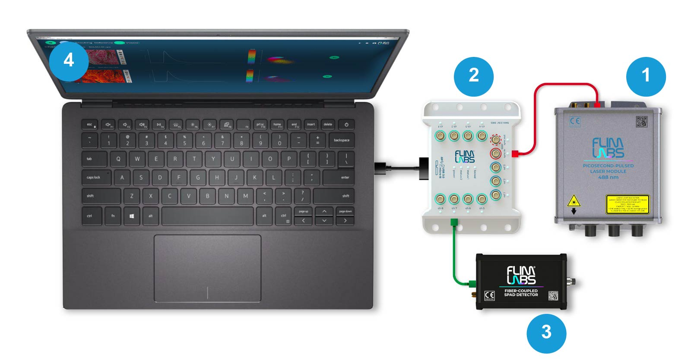

# flim_labs_api

## What is it? 

[flim_labs_api](/Flim_labs_api/flim_labs_api.py) is a Python API developed for controlling, acquiring and displaying <b>time tagged fluorescence photons' data</b> streamed from a data acquisition card based on FPGA technology in order to perform real time <b>Fluorescence Lifetime Imaging (FLIM) and Spectroscopy applications</b>.
Overall, this API sets up a communication system between Python and a FLIM data acquisition system based on FPGA that can receive data in various modes and store it for processing.

The complete FLIM kit developed by FLIM LABS for performing Fluorescence Lifetime Spectroscopy and Imaging looks like this:

<p align="center">



<p align="center">

1. Fiber-coupled picosecond pulsed laser module

2. FLIM data acquisition card

3. Single-photon SPAD detector

4. FLIM studio software

The channels' map of the data acquisition card are the following: 

<p align="center">


<p align="center">

For more informations on the single products you can check [FLIM LABS](https://www.flimlabs.com/) website.

## How to get it 

You can install flim_labs_api and the requested dependencies with the following *pip* command:

```
pip install flim_labs_api

```

## How to install drivers 

The drivers allowing the communication with the FPGA are pre-installed in your computer when running the *pip command* above.

If you want to manually install them you can find them inside the [drivers](/drivers) folder of this repo. The drivers' installers are put in two sub-folders containing the installers for x86 and x64 architectures respectively.


## Main features 

In the API five different acquisition modes are specified:

| Acquisition mode | Description |
|----------|----------|
| <b>Unset</b> | This is the default value of acquisition mode |
| <b>Photons_tracing</b> | Acquires the number of fluorescence photons in 100 microseconds time bins |
| <b>Spectroscopy</b> | Acquires the number of fluorescence photons in 50-100 picoseconds time bins (depending on the pulsed laser's frequency) and reconstruct the fluorescence lifetime decay curve |
| <b>Measure_frequency</b> | Acquires the frequency of the laser's pulses with a precision of hundreds of Hz for repetition rates of tens of MHz|
| <b>Raw_data</b> | Acquires and saves the data coming from the FPGA as binary files without processing |


## Firmwares 

In order to perform the different acquisition modes it is necessary to flash the appropriate firmware on the FPGA.

You can find a list of available firmwares in the folder [firmwares](/firmwares) of this repo. 


## How to use it

It is possible to find some [examples](/examples) here showing how to use flim_labs_api in all the acquisition modes.

In the API the class <b>FlimLabsApi</b> is defined to provide an interface to control and communicate with a FPGA device. The class has several methods, including:

* <b>receiver_task</b> is a method that runs in the receiver_thread and receives messages from a ZeroMQ socket connection. The received messages are then parsed based on the acquisition mode and added to a queue for processing. This method has no input parameters.

* <b>consumer_task</b> is a method that runs in the consumer_thread. It listens to the queue, retrieves messages from it, and then calls the consumer_handler method if it exists. If acquisition_mode is Photons_tracing, Measure_frequency, or Spectroscopy, the data is decoded and passed to the consumer_handler method.This method also checks if the acquisition time has been reached, and if so, it stops acquisition by calling the stop_acquisition method.                                                         

* <b>stop_acquisition</b> is a method that stops the acquisition process by killing the processes. This method has no input parameters

* <b>set_firmware</b> is a method that sets the firmware of the FPGA. This method has in input the parameter *firmware* representing the firmware to be flashed on the FPGA to perform the desired acquisition mode 

* <b>_acquire_from_reader</b> this private method starts the threads receiver_thread and consumer_thread by starting the receiver_task and consumer_task methods. Then, it starts the flim-processor and sends a command to the flim-processor to receive the acquisition mode. It sends the command arguments to the flim-processor, which includes firmware, output file, chunk size, chunks, and additional arguments


## Examples 


1. <b>Spectroscopy</b></li> 
  
[spectroscopy.py](/examples/spectroscopy.py) is an implementation of flim_labs_api for spectroscopy acquisition mode. You can use *spectroscopy.py* connecting the single photon detector with a SMA connector to channel 1 in the FPGA.
For a list of channels' map consult [map of channels](/images/image)
  
For immediate reference, *spectroscopy.py* content is reported below:
 
##### Needed libraries
  
```

  import matplotlib
  from matplotlib.backends.backend_qtagg import FigureCanvasQTAgg
  from matplotlib.figure import Figure
  from numpy import linspace

  matplotlib.use('Qt5Agg')

  import numpy as np
  from PyQt5.QtCore import QTimer, QMutex
  from PyQt5.QtWidgets import QApplication, QMainWindow, QPushButton, QLabel

  from flim_labs_api import FlimLabsApi
  
```

##### Define the MplCanvas class

This class creates the object *Figure* with the specified width, height, and dpi values that will be used for plotting the data.

```

class MplCanvas(FigureCanvasQTAgg):
    def __init__(self, parent=None, width=5, height=4, dpi=100):
        fig = Figure(figsize=(width, height), dpi=dpi)
        self.axes = fig.add_subplot(111)
        super(MplCanvas, self).__init__(fig)
		
```

##### Define the MainWindow class

This class defines the main GUI window by setting its size, position and title, together with the x and y axes of the 2D plot where the fluorescence lifetime decay curve is shown.

On the x axis the laser period (in nanoseconds) is decomposed in 256 bins. On the y axis we have the counts of the photons falling in each bin, so what is displayed is the number of photons having a certain delay from the laser's pulse with 50-100 picoseconds resolution. 

Also the laser frequency and the acquisition time of the experiment are set. The GUI window is completed with a start and stop button used to control the start and stop of the acquisition, a label to show the current number of photons received and a timer to refresh the plot every 100 ms.

```

class MainWindow(QMainWindow):
    def __init__(self, *args, **kwargs):
        super(MainWindow, self).__init__(*args, **kwargs)

        self.laser_mhz = 40
        self.acquisition_time_in_seconds = 28

        self.x_data = linspace(0, 1000 / self.laser_mhz, 256)
        self.y_data = np.zeros(256)

        self.setGeometry(512, 512, 1024, 1024)
        self.setWindowTitle('Spectroscopy ' + str(self.laser_mhz) + ' MHz')

        self.api = FlimLabsApi()
        self.api.set_consumer_handler(self.receive_point)

        self.chart = MplCanvas(self, width=12, height=5, dpi=100)
        self.chart.axes.plot(self.x_data, self.y_data)
        self.setCentralWidget(self.chart)

        # create timer to refresh histogram
        self.refresh_timer = QTimer()
        self.refresh_timer.timeout.connect(self.refresh_histogram)
        self.refresh_timer.setInterval(100)
        self.refresh_timer.start()

        # draw a button to start the acquisition
        self.start_button = QPushButton('Start', self)
        self.start_button.move(5, 5)
        self.start_button.clicked.connect(self.start_acquisition)
        
        # draw a button to STOP the acquisition
        self.stop_button = QPushButton('Stop', self)
        self.stop_button.move(120, 5)
        self.stop_button.clicked.connect(self.stop_acquisition)

        self.mutex = QMutex()

        # create a label to show the current phase
        self.phase_label = QLabel(self)
        self.phase_label.move(5, 40)
        self.phase_label.setText('Points received: 0')
        self.phase_label.adjustSize()
        self.points_received = 0
        
        self.show()        
		
```
  
##### Methods
  
In the same class the method *closeEvent* is defined to save as npz file the data acquired after we stop the acquisition:
  
```

def closeEvent(self, event):
        np.savez_compressed('spectroscopy', self.x_data, self.y_data)
        self.api.stop_acquisition()
        event.accept()
		
```
  
The *start_acquisition* method starts when pressing the start button and it is flashed the firmware for spectroscopy acquisition mode on the FPGA.
  
The *stop_acquisition* method starts when pressing the stop button to stop the acquisition of data from the FPGA. After the stop button is pressed the data in the histogram are reset, and also the number of received point is reset to zero, so that you can restart the acquisition by pressing again the start button. 
  
  
```

def start_acquisition(self):
        self.start_button.setEnabled(False)
        #self.api.set_firmware("firmwares\\spectroscopy_simulator_" + str(self.laser_mhz) + "MHz.flim")
        self.api.set_firmware("firmwares\\spectroscopy_40MHz_lvds_ch1.flim")
        #self.api.set_firmware("firmwares\\spectroscopy_80MHz.flim")
        self.api.acquire_spectroscopy(
            laser_frequency_mhz=self.laser_mhz,
            acquisition_time_seconds=self.acquisition_time_in_seconds
        )
        self.stop_button.setEnabled(True)
        
    def stop_acquisition(self):
        self.stop_button.setEnabled(False)
        self.api.stop_acquisition()
        self.y_data = np.zeros(256)
		self.points_received = 0
        self.start_button.setEnabled(True)
             
```
  
The *receive_point* method takes in input the following parameters:
  
* <b>channel</b>: channel from which the data are acquired 
* <b>time_bin</b>: digital bin within the laser period. As the laser period was decomposed in 256 bins, time_bin can be any integer value from 0 to 255 
* <b>micro_time</b>: variable representing the time bin in nanoseconds
* <b>monotonic_counter</b>: digital value accounting for the time passed from the beginning of the acquisition 
* <b>macro_time</b>: variable expressed in nanoseconds representing the time passed from the beginning of the acquisition
  

  
 
The *y_data* array is updated at the *time_bin* index by incrementing its value by 1. Also the number of points received is incremented by 1 for each photon received.
 
```

def receive_point(self, channel, time_bin, micro_time, monotonic_counter, macro_time):    
        self.mutex.lock()
        self.y_data[time_bin] += 1
        self.points_received += 1
        self.mutex.unlock()
            
```
 
A plot is made with the data stored in the *x_data* and *y_data* arrays and is updated with new data every 100 milliseconds by connecting the timeout signal of the timer to the *refresh_histogram* method:
 
```

def refresh_histogram(self):
        self.chart.axes.clear() 
        self.chart.axes.plot(self.x_data, self.y_data) 
        self.chart.axes.set_xlabel('Time (ns)') 
        self.chart.axes.set_ylabel('Photon counts') 
        self.chart.axes.set_xbound(0, 1000 / self.laser_mhz) 
        self.chart.draw() 
        # format points received with commas
        self.phase_label.setText(f'Total photons: {self.points_received:,}') 
        self.phase_label.adjustSize() 
		
```
 
This is an example of what is obtained using *spectroscopy.py* to reconstruct the fluorescence lifetime decay curve of a coumarin sample (1,5 micrograms/ml):
 

 
The data are also saved as binary files for further visualization and processing
 
 
 
2. <b>Measure-frequency</b>

[measure-frequency](/examples/measure-frequency.py) is an implementation of flim_labs_api for the measure_frequency acquisition mode. It measures the frequency of the laser pulses from the channel *sync in*.
 
The content of *measure-frequency* is reported below for immediate reference:
 
##### Needed libraries
 
```

from PyQt5.QtWidgets import QApplication, QMainWindow, QPushButton, QLabel

from flim_labs_api import FlimLabsApi


```

##### Define the MainWindow class

The main GUI window is defined by setting its size, position and title. The interface is completed with a start button to start the acquisition and a label showing the measured frequency of the laser pulses.

```

class MainWindow(QMainWindow):
    def __init__(self, *args, **kwargs):
        super(MainWindow, self).__init__(*args, **kwargs)
        self.setGeometry(512, 512, 1024, 1024) 
        self.setWindowTitle('Frequency meter') 

        self.api = FlimLabsApi()
        self.api.set_consumer_handler(self.receive_measure) 

        self.start_button = QPushButton('Start', self)
        self.start_button.move(5, 5)
        self.start_button.clicked.connect(self.start_meter)

        self.measure_label = QLabel(self)
        self.measure_label.move(5, 40)
        self.measure_label.setText('Press start to measure')
        self.measure_label.adjustSize()

        self.show()
		
```

##### Methods

The method *receive_measure* is called when a measurement is received from the frequency meter through the *FlimLabsApi* object. This method updates the *measure_label* with the measurement result and enables the *start_button*

```

def receive_measure(self, frequency):                 
        self.measure_label.setText('Measurement: ' + str(frequency) + ' MHz')
        self.measure_label.adjustSize()
        self.start_button.setEnabled(True)
        self.api.stop_acquisition()
        self.update()

```

The method *closeEvent* is called when the main window is closed. It stops the acquisition of data from the frequency meter.

```
	
def closeEvent(self, event):
			self.api.stop_acquisition()
			event.accept()
	
```

The method *start_meter* is called when the *start_button* is clicked. This method updates the *measure_label* with a message to indicate that the measurement is waiting, disables the *start_button*, sets the *firmware* for the frequency meter, and starts the acquisition of data.

```
	
def start_meter(self):                               
        self.measure_label.setText('Waiting for measure...')
        self.measure_label.adjustSize()
        self.start_button.setEnabled(False)
        self.api.set_firmware("firmwares\\frequency_meter.flim")
        self.api.acquire_measure_frequency()
        self.update()

```

This is an example of what is obtained to measure a pulsed laser's frequency of 80 MHz:


  


3. <b>Photons_tracing</b>

[photons_tracing](/examples/photons_tracing.py) is an example of using flim_labs_api for acquiring and displaying photons tracing data. You can acquire the data from all the 12 channels of the FPGA in this example.
 
The content of *photons_tracing* is reported below for immediate reference:
 
##### Needed libraries

```

import matplotlib
import numpy as np
from matplotlib.backends.backend_qtagg import FigureCanvasQTAgg
from matplotlib.figure import Figure
from numpy import linspace

matplotlib.use('Qt5Agg')

from PyQt5.QtCore import QTimer, QMutex
from PyQt5.QtWidgets import QApplication, QMainWindow, QPushButton, QLabel

from flim_labs_api import FlimLabsApi

```

##### Define the MplCanvas class

This class creates the object *Figure* with the specified width, height, and dpi values that will be used for plotting the data.

```

class MplCanvas(FigureCanvasQTAgg):
    def __init__(self, parent=None, width=5, height=4, dpi=100):
        fig = Figure(figsize=(width, height), dpi=dpi)
        self.axes = fig.add_subplot(111)
        super(MplCanvas, self).__init__(fig)
		
```

##### Define the MainWindow class

The MainWindow class initializes the GUI window, sets up the acquisition time and the acquisition channels and creates a chart for displaying the photon tracing data. It also sets up a timer for refreshing the chart, a button for starting the data acquisition, and a label for displaying the current phase of the acquisition:
The start button triggers an acquisition of photon tracing data by calling the method *acquire_photons_tracing* from the *flim_labs_api* library

```

class MainWindow(QMainWindow):
    def __init__(self, *args, **kwargs):
        super(MainWindow, self).__init__(*args, **kwargs)

        self.setGeometry(512, 512, 1024, 1024)
        self.setWindowTitle('Photons tracing')

        self.api = FlimLabsApi()
        self.api.set_consumer_handler(self.receive_data)

        self.chart = MplCanvas(self, width=12, height=5, dpi=100)
        self.setCentralWidget(self.chart)

        self.slice = 1 * SLICE_SECONDS        #?
        self.channels = [1]
        self.acquisition_time_in_seconds = 60

        self.data = []
        for _ in self.channels:
            self.data.append([])

        # create timer to refresh histogram
        self.refresh_timer = QTimer()
        self.refresh_timer.timeout.connect(self.refresh_histogram)
        self.refresh_timer.setInterval(1)
        self.refresh_timer.start()

        # draw a button to start the acquisition
        self.start_button = QPushButton('Start', self)
        self.start_button.move(5, 5)
        self.start_button.clicked.connect(self.start_acquisition)

        self.mutex = QMutex()

        # create a label to show the current phase
        self.phase_label = QLabel(self)
        self.phase_label.move(5, 40)
        self.phase_label.setText('Row received: 0')
        self.phase_label.adjustSize()
        self.rows_received = 0

        

        self.show()
		
```

##### Methods

The *closeEvent* method is called when the user closes the application. It stops the acquisition of data, saves the data to a file, and closes the application.

```

    def closeEvent(self, event):
        self.api.stop_acquisition()
        np.savez_compressed('photons_tracing', data=self.data)
        event.accept()
		
```

The *receive_data* method takes in input the parameter *row_data* , which is a list containing the photon counts for each channel in a particular time bin, and then appends the corresponding photon count to the channel's data.
The variable *self.rows_received* is then incremented to keep track of the number of rows of data received.

```

def receive_data(self, row_data):
        self.mutex.lock()
        for i, channel in enumerate(self.channels):
            
            self.data[i].append(row_data[i])
        self.rows_received += 1
        self.mutex.unlock()
		
```

The *refresh_histogram* method is called every 1 millisecond by a QTimer instance to update the histogram with new data.

```
def refresh_histogram(self):
        try:
            self.chart.axes.clear()
            total_x = len(self.data[0])
            slice_x = min(total_x, self.slice)
            if slice_x == 0:
                return
            starting_seconds = max((total_x - slice_x) / SLICE_SECONDS, 0)
            x_data = linspace(starting_seconds, starting_seconds + (self.slice / SLICE_SECONDS),
                              num=min(slice_x, self.slice))
            for i, channel in enumerate(self.channels):
                self.chart.axes.plot(x_data, self.data[i][-slice_x:])
            self.chart.axes.set_xbound(lower=starting_seconds,
                                       upper=starting_seconds + (min(slice_x, self.slice) / SLICE_SECONDS))
            self.chart.axes.set_xlabel('Time Bins (100μs)')
            self.chart.axes.set_ylabel('Photon counts')
            self.chart.draw()
            self.phase_label.setText(f'Bins received: {self.rows_received}')
            self.phase_label.adjustSize()
        except Exception as e:
            print(e)
            import traceback
            traceback.print_exc()
            raise e

```

This is an example of what is obtained using *photons_tracing.py* to check the intensity of fluorescence photons in 100 microseconds time bins for a coumarin sample (1,5 micrograms/ml):
 

 
The data are also saved as binary files for further visualization and processing.


4. <b>Raw_data</b> 

[acquire_raw_data](/examples/acquire_raw_data.py)is an example of using flim_labs_api to acquire the data coming from the FPGA without processing and save them as .bin file.
You just have to flash the firmware for the acquisition mode you're interested in and specify the size in MB of the data you want to acquire.

``` 
from flim_labs_api import FlimLabsApi, generate_unique_filename

api = FlimLabsApi()

output_filename = 'acquisition_raw.bin'
firmware = 'firmwares\\photons_tracing_simulator.flim'
acquisition_size_in_MB = 25

api.acquire_raw_data(firmware, generate_unique_filename(output_filename, "datetime"),
                     acquisition_size_in_MB)

```


